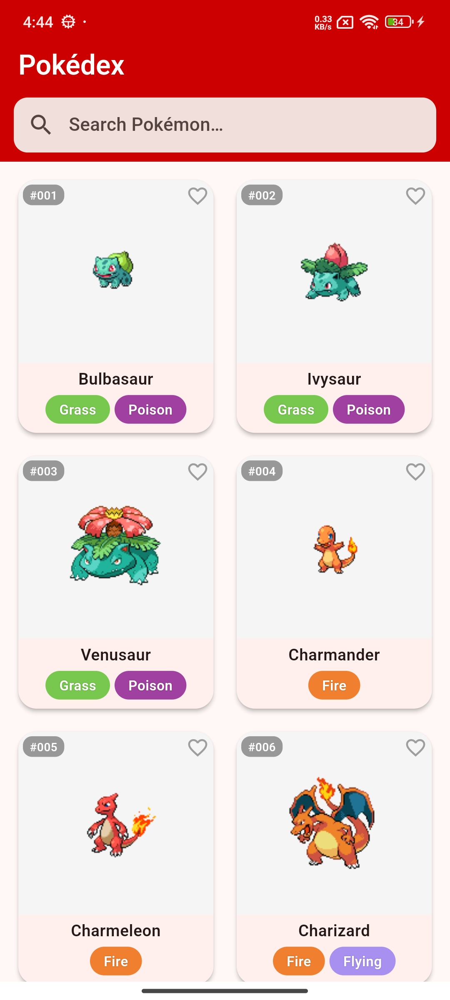
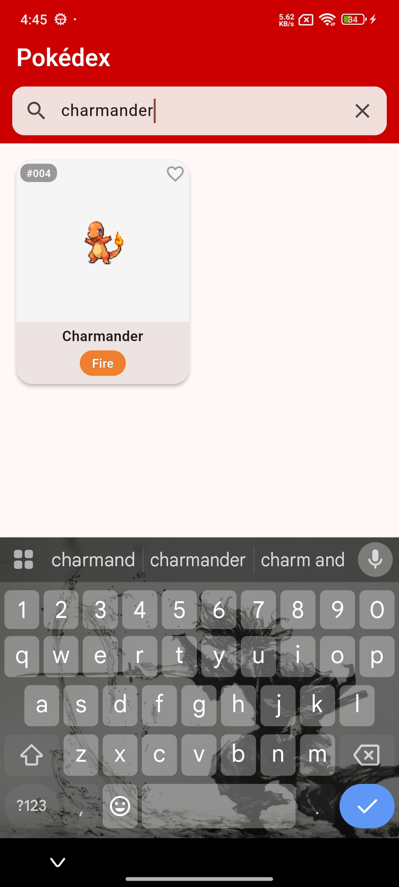
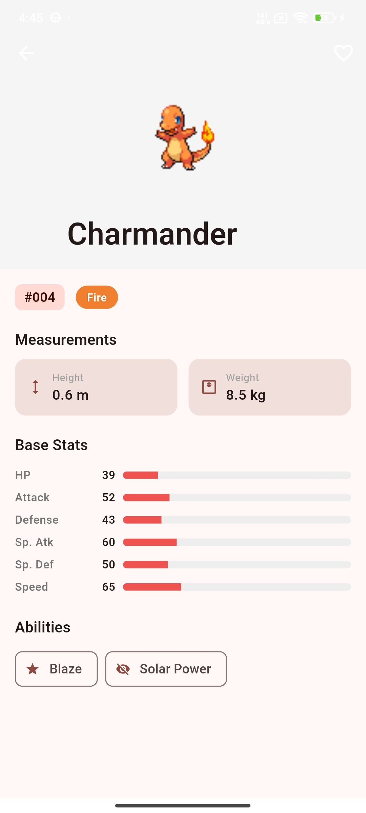
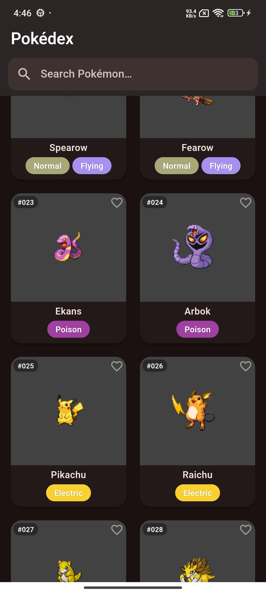

# Pokédex Flutter App

A clean, modern Flutter mobile application that fetches live Pokémon data from [PokéAPI](https://pokeapi.co) and presents it across two screens with smooth animations, search, infinite scroll, favourites, and full dark mode support.

---

## Features

- **List Screen** — Searchable grid of Pokémon with sprite images, type badges, and ID numbers
- **Detail Screen** — Full Pokémon info: sprite, ID, types, height, weight, animated stat bars, and abilities
- **Search** — Filter Pokémon by name in real time
- **Infinite Scroll** — Automatically loads the next 30 Pokémon as you scroll
- **Pull-to-Refresh** — Swipe down to reload the list
- **Favourites** — Heart icon to save favourites; persisted across app restarts
- **Dark Mode** — Follows the device system theme automatically
- **Hero Animations** — Smooth sprite transition between list and detail screens
- **Error Handling** — User-friendly error messages with a Retry button on both screens

---

## Getting Started

### Prerequisites

- Flutter SDK installed ([flutter.dev](https://flutter.dev/docs/get-started/install))
- An Android emulator, iOS simulator, or physical device connected

### Clone and Run

```bash
# 1. Clone the repository
git clone https://github.com/kovilapu-bharat/Pokedex.git
cd Pokedex

# 2. Install dependencies
flutter pub get

# 3. Run the app
flutter run
```

---

## Flutter & Dart Version

Run `flutter --version` to confirm. This project was built with:

```
Flutter 3.24.2  •  channel stable  •  Dart 3.5.2  •  DevTools 2.37.2
```

---

## Third-Party Packages

| Package | Version | Purpose |
|---|---|---|
| `flutter_riverpod` | ^2.6.1 | State management — handles loading, success, and error states cleanly |
| `http` | ^1.2.2 | HTTP GET requests to PokéAPI |
| `cached_network_image` | ^3.4.1 | Efficient Pokémon sprite loading with in-memory and disk caching |
| `shared_preferences` | ^2.3.3 | Persists favourite Pokémon IDs across app restarts |

---

## Project Structure

```
lib/
├── main.dart                        # App entry point, ProviderScope, theme
├── models/
│   ├── pokemon_list_item.dart       # List endpoint response models
│   └── pokemon_detail.dart          # Detail endpoint response model
├── services/
│   └── pokemon_service.dart         # All HTTP calls to PokéAPI
├── providers/
│   ├── pokemon_providers.dart       # Riverpod providers for list + detail
│   └── favourites_provider.dart     # Riverpod provider for favourites
├── screens/
│   ├── pokemon_list_screen.dart     # Screen 1: searchable grid
│   └── pokemon_detail_screen.dart   # Screen 2: full Pokémon detail
└── widgets/
    ├── pokemon_card.dart            # Grid card with sprite, name, types
    ├── stat_bar.dart                # Animated progress bar for base stats
    └── type_badge.dart              # Coloured pill badge for Pokémon types
```

---

## Design Decisions

- **Riverpod** was chosen for state management because `AsyncNotifierProvider` cleanly models the three required UI states (loading / success / error) with minimal boilerplate.
- **Detail calls on list items**: The list endpoint only returns name and URL. A detail API call is made for each visible Pokémon to retrieve the sprite and types, as required by the assignment spec.
- **Pagination**: The app fetches 30 Pokémon per page (matching the API default) and appends results as the user scrolls, without replacing existing data.
- **Hero animations**: The sprite image is wrapped in a `Hero` widget so it transitions smoothly between the list card and the detail screen.
- **Stat bar colours**: Bars are coloured red (low), orange (medium), or green (high) based on the stat value relative to the maximum possible (255), giving instant visual feedback.

---

## AI Tool Disclosure

This project was developed with the assistance of **Google Gemini (Antigravity)**, an AI coding assistant. The AI helped generate the initial project structure, boilerplate code, and documentation. All code was reviewed and is understood by the developer.

---

## Screenshots

| List Screen | Search | Detail Screen | Dark Mode |
|---|---|---|---|
|  |  |  |  |
